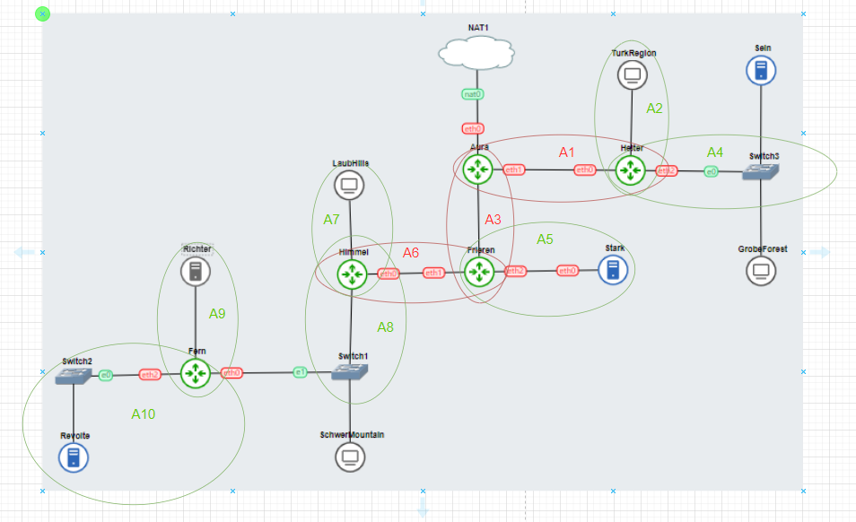
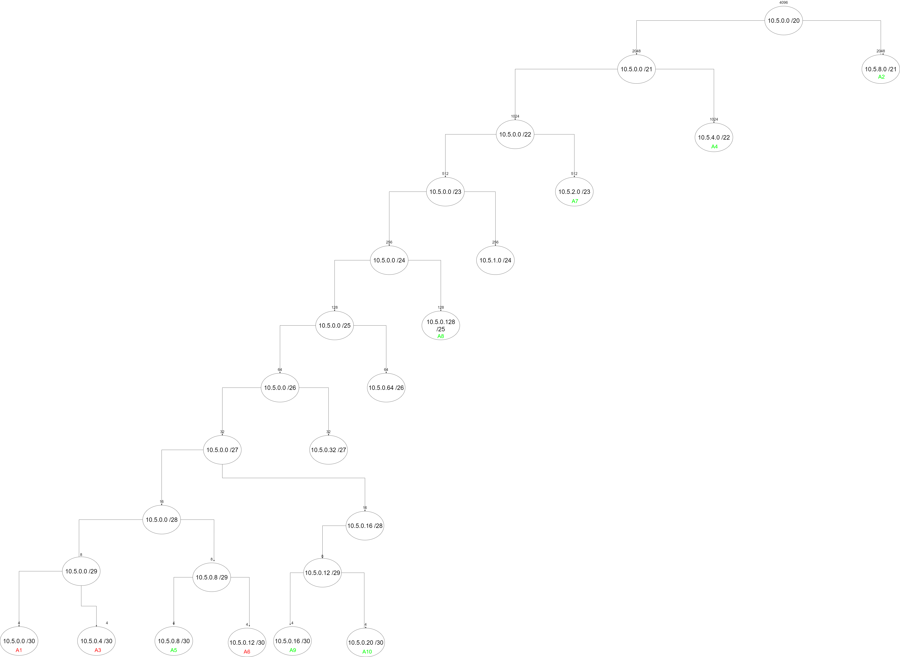
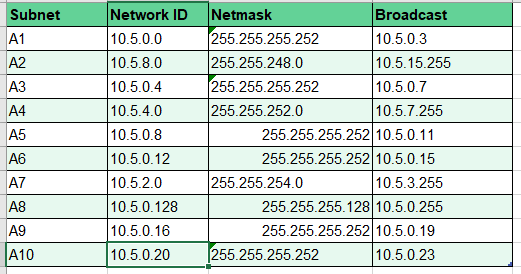
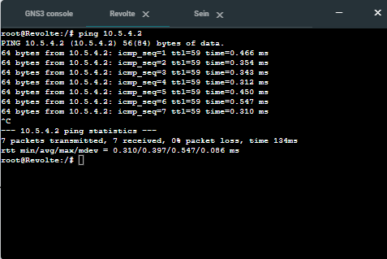
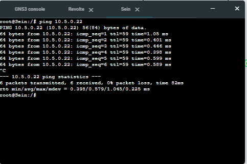
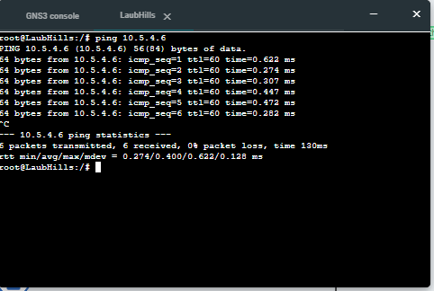

# Jarkom-Modul-5-A12-2023


# Subnetting


# VLSM


## IP-List


# Network Configuration & Route
- Aura
```
auto eth0
iface eth0 inet dhcp

auto eth1
iface eth1 inet static
address 10.5.0.1
netmask 255.255.255.252

auto eth2
iface eth2 inet static
address 10.5.0.5
netmask 255.255.255.252

#eth2
up route add -net 10.5.0.20 netmask 255.255.255.252 gw 10.5.0.6
up route add -net 10.5.0.16 netmask 255.255.255.252 gw 10.5.0.6
up route add -net 10.5.2.0 netmask 255.255.254.0 gw 10.5.0.6
up route add -net 10.5.0.128 netmask 255.255.255.128 gw 10.5.0.6
up route add -net 10.5.0.8 netmask 255.255.255.252 gw 10.5.0.6
up route add -net 10.5.0.12 netmask 255.255.255.252 gw 10.5.0.6

#eth1
up route add -net 10.5.4.0 netmask 255.255.255.0 gw 10.5.0.2
up route add -net 10.5.8.0 netmask 255.255.248.0 gw 10.5.0.2

```

- ### Heiter
```
auto eth0
iface eth0 inet static
address 10.5.0.2
netmask 255.255.255.252
gateway 10.5.0.1

auto eth1
iface eth1 inet static
address 10.5.8.1
netmask 255.255.248.0

auto eth2
iface eth2 inet static
address 10.5.4.1
netmask 255.255.255.0

```

- ### Frieren
```
auto eth0
iface eth0 inet static
address 10.5.0.6
netmask 255.255.255.252
gateway 10.5.0.5

auto eth1
iface eth1 inet static
address 10.5.0.13
netmask 255.255.255.252

auto eth2
iface eth2 inet static
address 10.5.0.9
netmask 255.255.255.252

up route add -net 10.5.0.20 netmask 255.255.255.252 gw 10.5.0.14
up route add -net 10.5.0.16 netmask 255.255.255.252 gw 10.5.0.14
up route add -net 10.5.2.0 netmask 255.255.254.0 gw 10.5.0.14
up route add -net 10.5.0.128 netmask 255.255.255.128 gw 10.5.0.14


```

- ### Himmel
```
auto eth0
iface eth0 inet static
address 10.5.0.14
netmask 255.255.255.252
gateway 10.5.0.13

auto eth1
iface eth1 inet static
address 10.5.0.129
netmask 255.255.255.128

auto eth2
iface eth2 inet static
address 10.5.2.1
netmask 255.255.254.0

up route add -net 10.5.0.20 netmask 255.255.255.252 gw 10.5.0.130
up route add -net 10.5.0.16 netmask 255.255.255.252 gw 10.5.0.130

```

- ### Fern
```
auto eth0
iface eth0 inet static
address 10.5.0.130
netmask 255.255.255.128
gateway 10.5.0.129

auto eth1
iface eth1 inet static
address 10.5.0.17
netmask 255.255.255.252

auto eth2
iface eth2 inet static
address 10.5.0.21
netmask 255.255.255.252


```

- ### TurkRegion
```
auto eth0
iface eth0 inet dhcp

```

- ### Sein
```
auto eth0
iface eth0 inet static
address 10.5.4.2
netmask 255.255.255.252
gateway 10.5.4.1

```

- ### GrobeForest
```
auto eth0
iface eth0 inet dhcp

```

- ### Stark
```
auto eth0
iface eth0 inet static
address 10.5.0.10
netmask 255.255.255.252
gateway 10.5.0.9

```

- ### SchewerMountain
```
auto eth0
iface eth0 inet dhcp

```

- ### Revolte
```
auto eth0
iface eth0 inet static
address 10.5.0.22
netmask 255.255.255.252
gateway 10.5.0.21

```

- ### Richter
```
auto eth0
iface eth0 inet static
address 10.5.0.18
netmask 255.255.255.252
gateway 10.5.0.17

```

- ### LaubHills
```
auto eth0
iface eth0 inet dhcp

```

# Setup
- ### Aura (DHCP Relay, Edge Router)
``` bash
# Populate NAT iptables to enable NAT
iptables -t nat -A POSTROUTING -o eth0 -j MASQUERADE -s 10.5.0.0/16

# Install Required Packages
apt-get update
apt-get install isc-dhcp-relay -y

# Config DHCP Relay
echo "
net.ipv4.ip_forward=1
" > /etc/sysctl.conf
echo '
SERVERS="10.5.0.22"
INTERFACES="eth1 eth2"
OPTIONS=""
' > /etc/default/isc-dhcp-relay

# Start DHCP Relay
service isc-dhcp-relay start

# Set DNS Server
echo nameserver 10.5.0.18 > /etc/resolv.conf
```

- ### Richter (DNS Server)
``` bash
# Set DNS Server
echo nameserver 192.168.122.1 > /etc/resolv.conf

# Install Required Packages
apt-get update
apt-get install bind9 -y 

# Prepare Directory
mkdir -p /etc/bind/praktikum

# Enable DNS Forwarder
echo '
options {
  directory "/var/cache/bind";
  forwarders {
    192.168.122.1;
  };
  allow-query{any;};

  listen-on-v6 { any; };
};
' > /etc/bind/named.conf.options

service bind9 restart
```

- ### Heiter (DHCP Relay)
``` bash
# Set DNS Server
echo nameserver 10.5.0.18 > /etc/resolv.conf

# Install Required Packages
apt-get update
apt-get install isc-dhcp-relay -y

# Config DHCP Relay
echo "
net.ipv4.ip_forward=1
" > /etc/sysctl.conf
echo '
SERVERS="10.5.0.22"
INTERFACES="eth0 eth1 eth2"
OPTIONS=""
' > /etc/default/isc-dhcp-relay

# Start DHCP Relay
service isc-dhcp-relay start
```

- ### Frieren (DHCP Relay)
``` bash
# Set DNS Server
echo nameserver 10.5.0.18 > /etc/resolv.conf

# Install Required Packages
apt-get update
apt-get install isc-dhcp-relay -y

# Config DHCP Relay
echo "
net.ipv4.ip_forward=1
" > /etc/sysctl.conf
echo '
SERVERS="10.5.0.22"
INTERFACES="eth0 eth1 eth2"
OPTIONS=""
' > /etc/default/isc-dhcp-relay

# Start DHCP Relay
service isc-dhcp-relay start
```

- ### Himmel (DHCP Relay)
``` bash
# Set DNS Server
echo nameserver 10.5.0.18 > /etc/resolv.conf

# Install Required Packages
apt-get update
apt-get install isc-dhcp-relay -y

# Config DHCP Relay
echo "
net.ipv4.ip_forward=1
" > /etc/sysctl.conf
echo '
SERVERS="10.5.0.22"
INTERFACES="eth0 eth1 eth2"
OPTIONS=""
' > /etc/default/isc-dhcp-relay

# Start DHCP Relay
service isc-dhcp-relay start
```

- ### Fern (DHCP Relay)
``` bash
# Set DNS Server
echo nameserver 10.5.0.18 > /etc/resolv.conf

# Install Required Packages
apt-get update
apt-get install isc-dhcp-relay -y

# Config DHCP Relay
echo "
net.ipv4.ip_forward=1
" > /etc/sysctl.conf
echo '
SERVERS="10.5.0.22"
INTERFACES="eth0 eth1 eth2"
OPTIONS=""
' > /etc/default/isc-dhcp-relay

# Start DHCP Relay
service isc-dhcp-relay start
```

- ### Revolte (DHCP Server)
``` bash
# Set DNS Server
echo nameserver 10.5.0.18 > /etc/resolv.conf

# Install Required Packages
apt-get update
apt-get install isc-dhcp-server --no-install-recommends -y

# Set DHCP Interface
echo '
INTERFACESv4="eth0"
INTERFACESv6=""
' > /etc/default/isc-dhcp-server

# Config DHCP Server
echo '
default-lease-time 600;
max-lease-time 7200;

ddns-update-style none;

#A1
subnet 10.5.0.0 netmask 255.255.255.252 {
}

#A2
subnet 10.5.8.0 netmask 255.255.248.0 {
    range 10.5.8.2 10.5.8.254;
    option routers 10.5.8.1;
    option broadcast-address 10.5.8.255;
    default-lease-time 180;
    max-lease-time 5760;
}

#A3
subnet 10.5.0.4 netmask 255.255.255.252 {
}

#A4
subnet 10.5.4.0 netmask 255.255.255.0 {
    range 10.5.4.2 10.5.7.254;
    option routers 10.5.4.1;
    option broadcast-address 10.5.7.255;
    default-lease-time 180;
    max-lease-time 5760;
}

#A5
subnet 10.5.0.8 netmask 255.255.255.252 {
}

#A6
subnet 10.5.0.12 netmask 255.255.255.252 {
}

#A7
subnet 10.5.2.0 netmask 255.255.254.0 {
    range 10.5.2.2 10.5.2.254;
    option routers 10.5.2.1;
    option broadcast-address 10.5.2.255;
    default-lease-time 180;
    max-lease-time 5760;
}

#A8
subnet 10.5.0.128 netmask 255.255.255.128 {
    range 10.5.0.131 10.5.0.254;
    option routers 10.5.0.129;
    option broadcast-address 10.5.0.255;
    default-lease-time 180;
    max-lease-time 5760;
}

#A9
subnet 10.5.0.16 netmask 255.255.255.252 {
}

#A10
subnet 10.5.0.20 netmask 255.255.255.252{
}
' > /etc/dhcp/dhcpd.conf

# Enable dhcp server
service isc-dhcp-server restart
```

- ### Sein (Web Server)
``` bash
# Set DNS Server
echo nameserver 10.5.0.18 > /etc/resolv.conf

# Install Required Packages
apt-get update
apt-get install netcat -y
```

- ### Stark (Web Server)
``` bash
# Set DNS Server
echo nameserver 10.5.0.18 > /etc/resolv.conf

# Install Required Packages
apt-get update
apt-get install netcat -y
```

# Soal
1. Agar topologi yang kalian buat dapat mengakses keluar, kalian diminta untuk mengkonfigurasi Aura menggunakan iptables, tetapi tidak ingin menggunakan MASQUERADE.
2. Kalian diminta untuk melakukan drop semua TCP dan UDP kecuali port 8080 pada TCP.
3. Kepala Suku North Area meminta kalian untuk membatasi DHCP dan DNS Server hanya dapat dilakukan ping oleh maksimal 3 device secara bersamaan, selebihnya akan di drop.
4. Lakukan pembatasan sehingga koneksi SSH pada Web Server hanya dapat dilakukan oleh masyarakat yang berada pada GrobeForest.
5. Selain itu, akses menuju WebServer hanya diperbolehkan saat jam kerja yaitu Senin-Jumat pada pukul 08.00-16.00.
6. Lalu, karena ternyata terdapat beberapa waktu di mana network administrator dari WebServer tidak bisa stand by, sehingga perlu ditambahkan rule bahwa akses pada hari Senin - Kamis pada jam 12.00 - 13.00 dilarang (istirahat maksi cuy) dan akses di hari Jumat pada jam 11.00 - 13.00 juga dilarang (maklum, Jumatan rek).
7. Karena terdapat 2 WebServer, kalian diminta agar setiap client yang mengakses Sein dengan Port 80 akan didistribusikan secara bergantian pada Sein dan Stark secara berurutan dan request dari client yang mengakses Stark dengan port 443 akan didistribusikan secara bergantian pada Sein dan Stark secara berurutan.
8. Karena berbeda koalisi politik, maka subnet dengan masyarakat yang berada pada Revolte dilarang keras mengakses WebServer hingga masa pencoblosan pemilu kepala suku 2024 berakhir. Masa pemilu (hingga pemungutan dan penghitungan suara selesai) kepala suku bersamaan dengan masa pemilu Presiden dan Wakil Presiden Indonesia 2024.
9. Sadar akan adanya potensial saling serang antar kubu politik, maka WebServer harus dapat secara otomatis memblokir  alamat IP yang melakukan scanning port dalam jumlah banyak (maksimal 20 scan port) di dalam selang waktu 10 menit. (clue: test dengan nmap)
10. Karena kepala suku ingin tau paket apa saja yang di-drop, maka di setiap node server dan router ditambahkan logging paket yang di-drop dengan standard syslog level

# Jawaban

## No. 1
Jalankan
``` bash
# Flush NAT Table
iptables -t nat -F

# Set SNAT rule for NAT postrouting
iptables -t nat -A POSTROUTING -o eth0 -j SNAT --to-source $(ifconfig eth0 | awk -F ' *|:' '/inet addr/{print $4}')
```

## No. 2
Jalankan
``` bash
iptables -F

iptables -A INPUT -p icmp -j ACCEPT

iptables -A INPUT -p tcp --dport 8080 -j ACCEPT

iptables -A INPUT -p tcp -j DROP

iptables -A INPUT -p udp -j DROP
```

## No. 3
Jalankan
``` bash
iptables -A INPUT -m state --state ESTABLISHED,RELATED -j ACCEPT

iptables -A INPUT -p icmp -m connlimit --connlimit-above 3 --connlimit-mask 0 -j DROP
```

## No. 4
Jalankan
``` bash
iptables -A INPUT -p tcp --dport 22 -s 192.177.4.0/22 -j ACCEPT

iptables -A INPUT -p tcp --dport 22 -j DROP
```

## No. 6
Jalankan
``` bash
iptables -A INPUT -p tcp --dport 22 -s 10.5.4.0/22 -m time --timestart 12:00 --timestop 13:00 --weekdays Mon,Tue,Wed,Thu -j DROP

iptables -A INPUT -p tcp --dport 22 -s 10.5.4.0/22 -m time --timestart 11:00 --timestop 13:00 --weekdays Fri -j DROP
```

# Demo
## test routing and subneting

### 1. Revolte to Sein


### 2. Sein to Revolte


### 3. LaubHills to GrobeForest

